# Rides Confirmation — End-to-End Data Engineering Pipeline

An end-to-end data engineering project that processes Uber-style ride confirmation data through **batch and real-time ingestion pipelines** using Azure Data Factory, Azure Event Hubs, ADLS Gen2, and Azure Databricks.

The pipeline follows a **Medallion Architecture** and demonstrates metadata-driven ingestion, real-time event streaming, data enrichment, dimensional modeling, SCD Type 1/2, and data-quality validation.

---

## 🏗️ Architecture

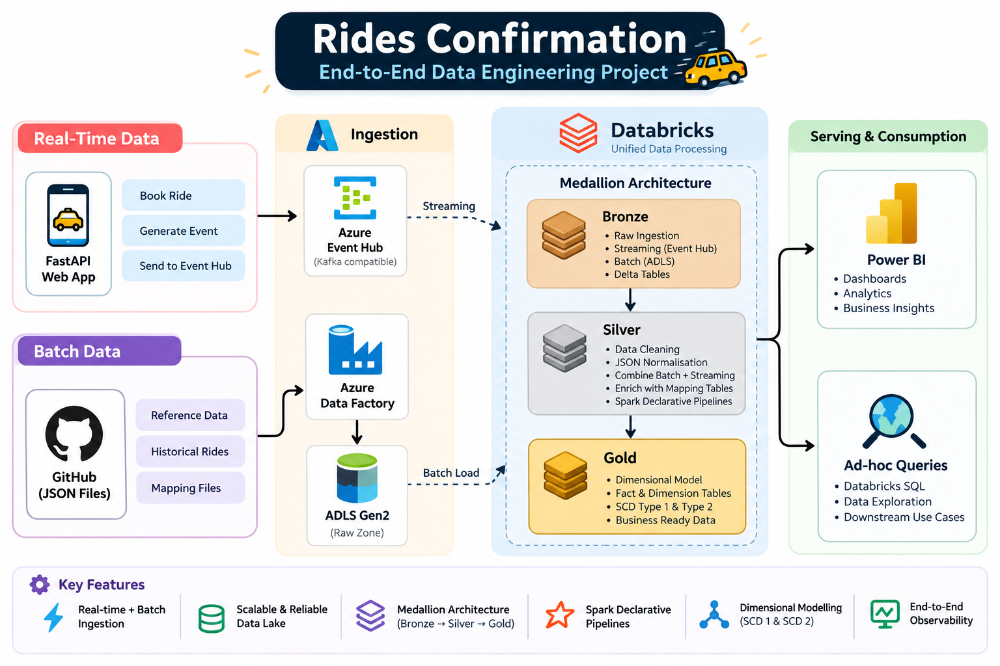

The platform combines two ingestion paths:

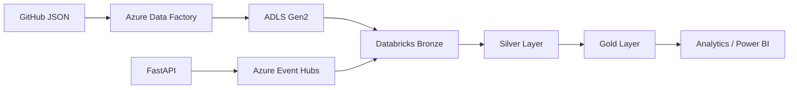

### Ingestion Paths

| Path | Purpose | Technologies |
|---|---|---|
| Batch | Historical and static data | GitHub → ADF → ADLS |
| Streaming | New ride confirmations | FastAPI → Event Hubs → Databricks |

---

# ⚡ Real-Time Ride Flow

When a user books a ride, the application generates a ride confirmation event and sends it to Azure Event Hubs.

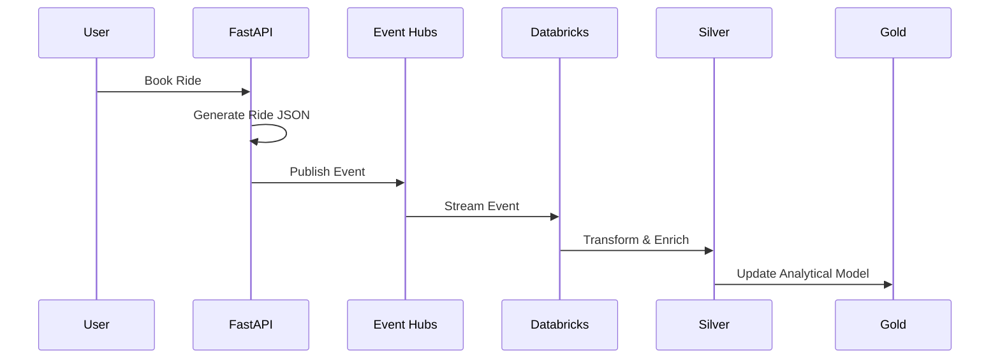

### Application

The FastAPI application generates synthetic ride confirmation data using Faker.


### Event Hub

The generated ride event is published to Azure Event Hubs.

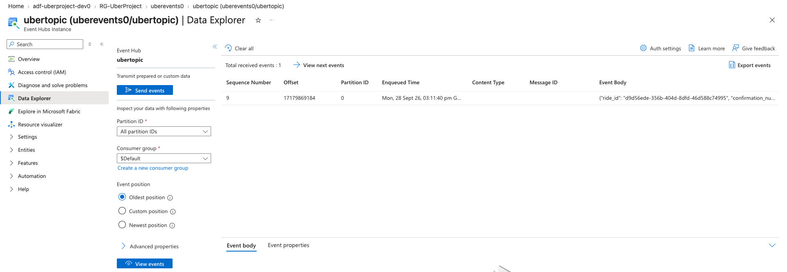

---

# 📦 Batch Ingestion

Historical ride data and reference data are ingested using Azure Data Factory.

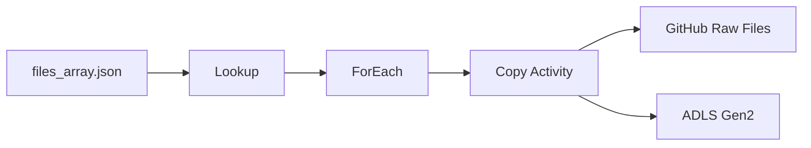

The ADF pipeline is metadata-driven rather than requiring a separate Copy Activity for every file.

The metadata file contains the files that need to be ingested:

```json
[
  {"file": "bulk_rides"},
  {"file": "map_cancellation_reasons"},
  {"file": "map_cities"},
  {"file": "map_payment_methods"},
  {"file": "map_ride_statuses"},
  {"file": "map_vehicle_makes"},
  {"file": "map_vehicle_types"}
]
```

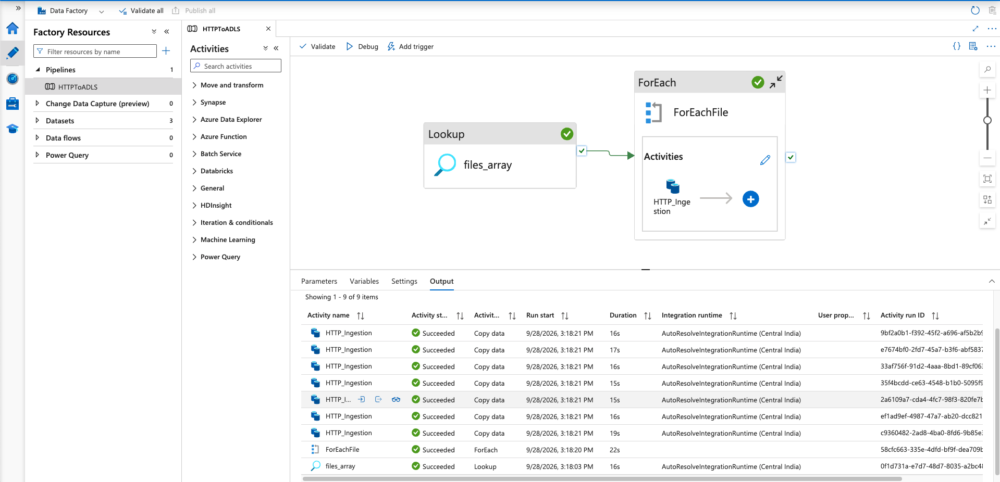

---

# 🥉 Bronze Layer

The Bronze layer contains the initial ingestion of historical and real-time data.

## Historical Data

Data from ADLS Gen2 is loaded into Delta tables such as:

```text
uber.bronze.bulk_rides
uber.bronze.map_cities
uber.bronze.map_vehicle_types
uber.bronze.map_payment_methods
```
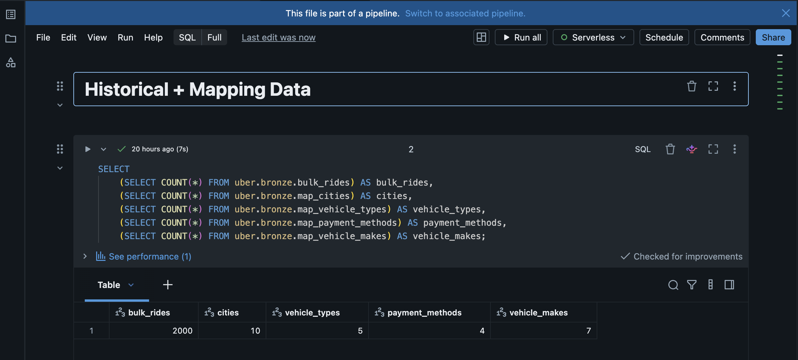

## Streaming Data

Real-time Event Hub messages are consumed through the Kafka-compatible endpoint using Spark Structured Streaming:

```python
spark.readStream.format("kafka")
```

The streaming events are stored in:

```text
uber.bronze.rides_raw
```

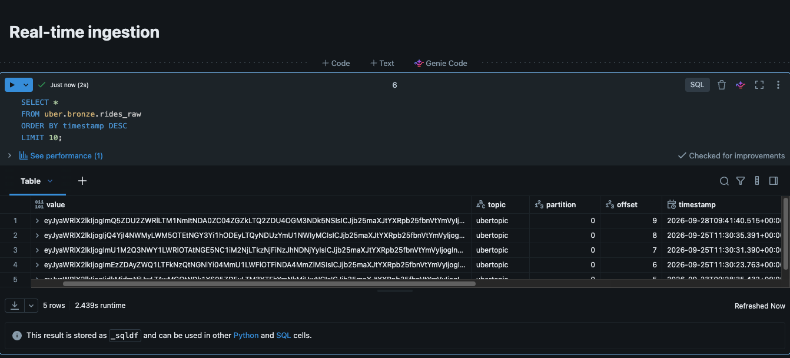

---

# 🥈 Silver Layer

The Silver layer combines historical and streaming ride data and enriches the ride events with reference data.

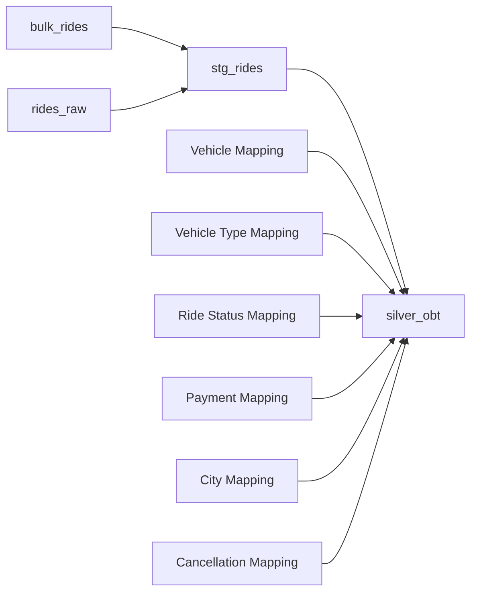

## `stg_rides`

`stg_rides` provides a unified streaming interface for:

- Historical ride data
- Real-time ride data

Spark Declarative Pipelines append flows are used to bring both sources into the same streaming table.

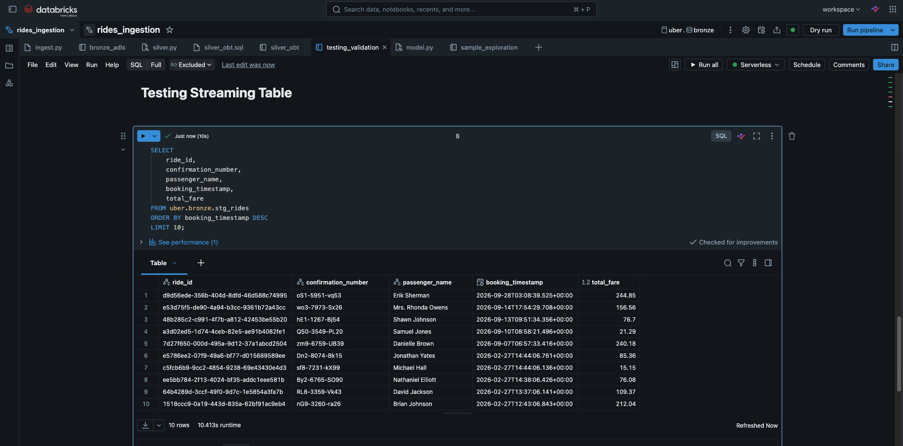

## `silver_obt`

`silver_obt` is the enriched Silver dataset.

It joins ride data with reference tables containing:

- Vehicle information
- Vehicle type information
- Payment information
- Ride status
- City information
- Cancellation reasons

A watermark on `booking_timestamp` is used to manage late-arriving streaming data and control streaming state.

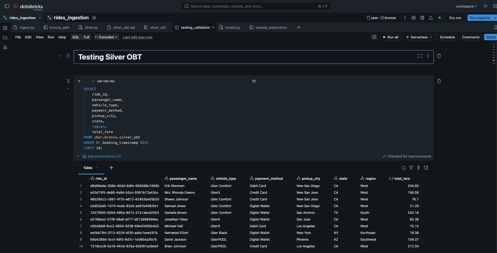
---
 

# 🥇 Gold Layer

The enriched Silver dataset is transformed into a dimensional model.

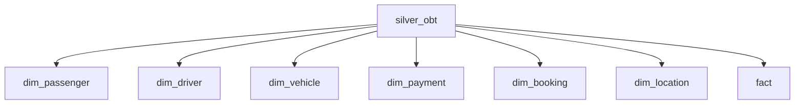


## Dimension Tables

| Table | Purpose |
|---|---|
| `dim_passenger` | Passenger information |
| `dim_driver` | Driver information |
| `dim_vehicle` | Vehicle information |
| `dim_payment` | Payment information |
| `dim_booking` | Booking information |
| `dim_location` | Location information and historical changes |

## Fact Table

The `fact` table contains ride-level measures such as:

- Distance
- Duration
- Base fare
- Distance fare
- Time fare
- Surge multiplier
- Total fare
- Tip
- Rating


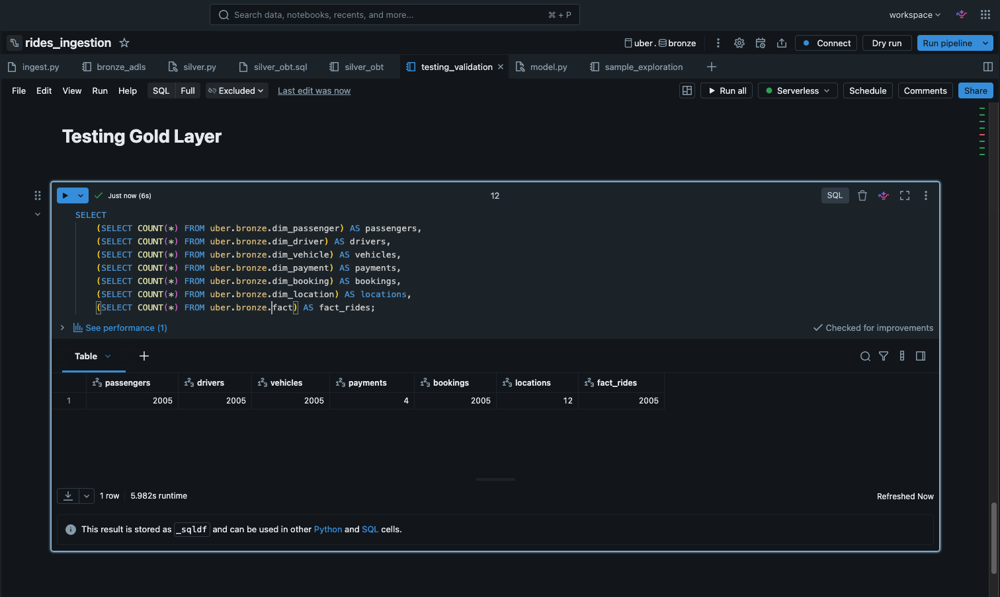

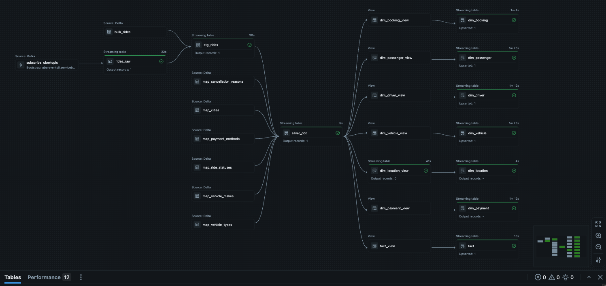
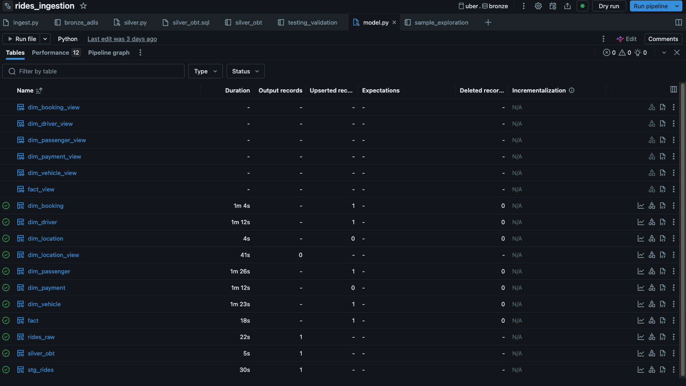
---

# 🔄 Slowly Changing Dimensions

The project implements both **SCD Type 1** and **SCD Type 2**.

## SCD Type 1

SCD Type 1 is used for dimensions where historical changes do not need to be retained.

Examples:

```text
dim_passenger
dim_driver
dim_vehicle
dim_payment
dim_booking
```

When a record changes, the existing value is updated.

## SCD Type 2

`dim_location` uses SCD Type 2 to preserve historical versions of location records.

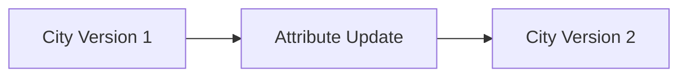

Historical versions are tracked using fields such as:

```text
__START_AT
__END_AT
```

This allows previous versions of a location record to remain available after an update.

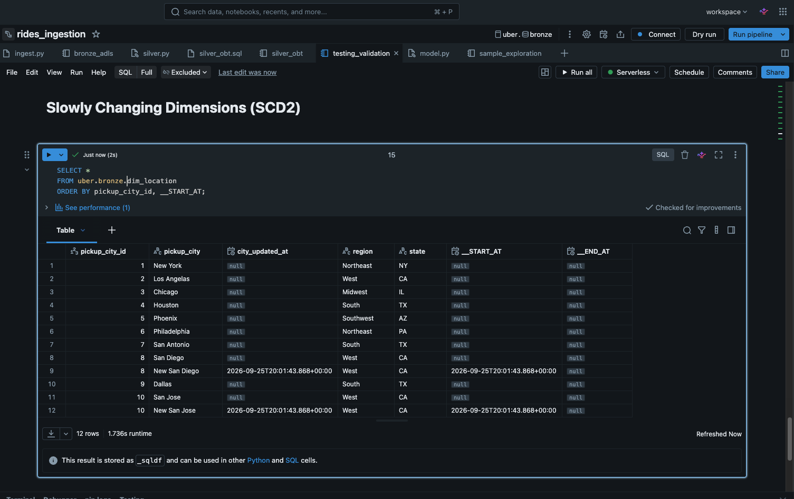

---

# 🧪 Data Quality & Validation

The project includes validation checks covering:

- Null ride IDs
- Duplicate ride IDs
- Negative fares
- Invalid ratings
- Missing vehicle mappings
- Bronze/Silver/Gold record counts
- Streaming ingestion
- SCD Type 2 history

Example validation query:

```sql
SELECT
    (SELECT COUNT(*)
     FROM uber.bronze.silver_obt
     WHERE ride_id IS NULL) AS null_ride_ids,

    (SELECT COUNT(*)
     FROM (
         SELECT ride_id
         FROM uber.bronze.silver_obt
         GROUP BY ride_id
         HAVING COUNT(*) > 1
     )) AS duplicate_ride_ids,

    (SELECT COUNT(*)
     FROM uber.bronze.silver_obt
     WHERE total_fare < 0) AS negative_fares;
```

Expected result:

```text
null_ride_ids | duplicate_ride_ids | negative_fares
--------------+--------------------+---------------
0             | 0                  | 0
```

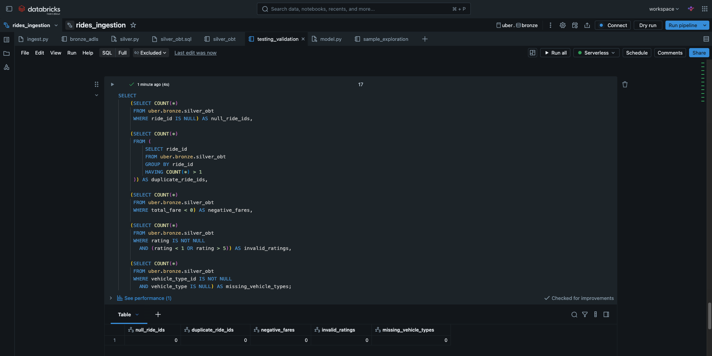

---

# ⚙️ Spark Declarative Pipelines

The Databricks transformation layer uses **Spark Declarative Pipelines**.

Instead of manually orchestrating every streaming query, the pipeline declares datasets, dependencies, append flows, and CDC flows.

Example:

```python
dp.create_streaming_table("stg_rides")

@dp.append_flow(target="stg_rides")
def rides_bulk():
    return spark.readStream.table("bulk_rides")

@dp.append_flow(target="stg_rides")
def rides_stream():
    return spark.readStream.table("rides_raw")
```

The pipeline framework manages the execution graph while the transformations continue to use standard Spark/PySpark APIs.

---

# 🛠️ Technology Stack

| Category | Technology |
|---|---|
| Application | FastAPI |
| Synthetic Data | Faker |
| Batch Orchestration | Azure Data Factory |
| Streaming | Azure Event Hubs |
| Data Lake | Azure Data Lake Storage Gen2 |
| Processing | Azure Databricks |
| Compute | Apache Spark / PySpark |
| Streaming Processing | Spark Structured Streaming |
| Pipeline Framework | Spark Declarative Pipelines |
| Storage Format | Delta Lake |
| Catalog | Unity Catalog |
| Query Language | Spark SQL |
| Templating | Jinja |
| Version Control | Git / GitHub |

---

# 📁 Repository Structure

```text
rides-confirmation/
│
├── app/
│   ├── api.py
│   ├── connection.py
│   ├── data.py
│   └── templates/
│       ├── confirmation.html
│       └── home.html
│
├── databricks/
│   ├── bronze/
│   │   ├── bronze_adls.py
│   │   └── ingest.py
│   │
│   ├── silver/
│   │   ├── silver.py
│   │   ├── silver_obt.py
│   │   └── silver_obt.sql
│   │
│   ├── gold/
│   │   └── model.py
│   │
│   └── utilities/
│       └── utils.py
│
├── adf/
│   └── files_array.json
│
├── tests/
│   └── testing_validation.sql
│
├── docs/
│   ├── architecture.png
│   └── screenshots/
│       ├── 01-fastapi-booking.png
│       ├── 02-event-hub.png
│       ├── 03-adf-pipeline.png
│       ├── 04-databricks-pipeline.png
│       ├── 05-stg-rides.png
│       ├── 06-silver-obt.png
│       ├── 07-gold-model.png
│       ├── 08-scd2.png
│       └── 09-data-quality.png
│
├── requirements.txt
├── .gitignore
└── README.md
```

---

# 🔐 Security

Credentials are intentionally excluded from source control.

The repository does **not** contain:

- Event Hub connection strings
- Azure SAS tokens
- Storage account keys
- `.env` files
- Authentication secrets

Local credentials are stored in `.env` and excluded through `.gitignore`.

Sensitive configuration is retrieved through environment variables or platform configuration rather than being embedded directly in source code.

> **Never commit `.env`, SAS tokens, connection strings, access keys, or other credentials to GitHub.**

---

# 🚀 Future Improvements

Potential productionization improvements include:

- [ ] Automated data-quality tests
- [ ] Idempotent event processing
- [ ] Improved schema evolution handling
- [ ] Azure Key Vault integration
- [ ] CI/CD
- [ ] Pipeline observability and alerting
- [ ] Infrastructure as Code
- [ ] Power BI analytical dashboard

---

# 📌 Project Status

### Completed

- [x] FastAPI ride generation
- [x] Azure Event Hubs streaming
- [x] Azure Data Factory batch ingestion
- [x] ADLS Gen2 storage
- [x] Databricks Bronze layer
- [x] Databricks Silver layer
- [x] Silver data enrichment
- [x] Gold dimensional model
- [x] SCD Type 1
- [x] SCD Type 2
- [x] Data quality validation
- [x] Repository organization
- [x] Secret removal from source code

### Planned

- [ ] Automated testing
- [ ] Idempotency / duplicate-event handling
- [ ] Improved observability
- [ ] Schema evolution handling
- [ ] CI/CD
- [ ] Power BI dashboard

---

# 👤 Author

**Kartikeya Saraswat**

AI/Data Engineering | Machine Learning | Data Science